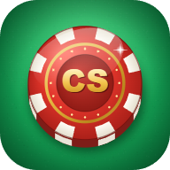

<p align="center">
  
</p>

<h1 align="center">ChipSplit</h1>

<p align="center">
  <b>Calculadora de fichas e gerenciador de poker caseiro.</b><br>
  Distribui as fichas, acompanha o jogo ao vivo e faz o acerto no fim: quem paga quem, no menor número de Pix.
</p>

<p align="center">
  <a href="https://nicorivis.github.io/chipsplit/"><b>▶ Abrir o app</b></a> ·
  <a href="https://nicorivis.github.io/chipsplit/guias/">Guias</a> ·
  <a href="docs/MANUAL.md">Manual</a>
</p>

<p align="center">
  
  
  
  
</p>

## O problema

Em todo jogo de poker em casa alguém perde 15 minutos tentando descobrir quanto vale cada ficha, ninguém anota os rebuys direito e o acerto no fim vira discussão. O ChipSplit resolve as três partes num app só, que abre no celular, funciona sem internet e não pede cadastro.

## O que ele faz

| | |
|---|---|
| **Novo jogo em 4 passos** | Quantas pessoas → Cash ou Torneio → kit de 300, 500 ou o seu → valor da entrada. Já mostra fichas por pessoa, pote e blinds. |
| **Distribuição exata** | Encontra valores para cada cor que fecham a entrada sem sobrar centavo, com stack de ~100 big blinds. Você pode travar o valor de uma cor e ele recalcula o resto. |
| **Mesa ao vivo** | Rebuy, add-on, eliminação, entrada no meio do jogo e saque, com horário exato de cada evento e **Desfazer** sempre à mão. |
| **Torneio** | Ordem de eliminação automática, classificação final ajustável e divisão de prêmios (padrão 50/30/20 ou o que você quiser). |
| **Acerto** | Confere se a contagem bate com o que entrou (bloqueia diferenças sem confirmação) e calcula o **mínimo de transferências** entre os jogadores. Resumo pronto para o WhatsApp. |
| **Histórico e perfil** | Jogos salvos no aparelho, estatísticas por jogador, backup em arquivo. |
| **4 idiomas, várias moedas** | Português, inglês, espanhol e chinês. Formatação de dinheiro pelo idioma. |
| **PWA** | Instala na tela inicial e funciona offline. |

## Como foi feito

- **HTML, CSS e JavaScript puros**, sem framework e sem etapa de build. Zero dependências em produção.
- **Dinheiro em centavos** (inteiros) em todo o código, para nunca ter erro de arredondamento.
- **A partida é uma lista de eventos** (`entrada`, `rebuy`, `eliminação`, `saque`, `fim`). O estado é sempre recalculado a partir dela, o que deixa o *Desfazer*, o histórico e a sincronização triviais e à prova de inconsistência.
- **Algoritmo de distribuição** com busca limitada: testa combinações de valores "redondos" por cor, respeita a quantidade de fichas do kit e prioriza o que o usuário digitou.
- **Acerto com mínimo de transferências**: casa devedores e credores de forma gulosa para reduzir o número de Pix.
- **52 testes automatizados** (`node tests/run-tests.js` ou `tests.html` no navegador) e testes de ponta a ponta com Playwright.
- **Service worker** com cache versionado, View Transitions API para a troca de telas, respeito a `prefers-reduced-motion`.
- **Pronto para login com Google** (Firebase Auth + Firestore, com regras de acesso só do dono); fica desligado até o projeto Firebase ser configurado em `config.js`.
- **Privacidade**: sem conta, tudo fica no aparelho. Nenhum dado sai do navegador.

## Estrutura

```
index.html          telas (Calcular, Jogo, Histórico, Perfil)
chipsplit-core.js   cálculo da distribuição (puro, testável no Node)
session-core.js     partida como lista de eventos, torneio, acerto
app.js              tela Calcular
wizard.js           "Novo jogo" guiado + faixa Retomar
live.js             mesa ao vivo, contagem, resultado, histórico
i18n.js             textos nos 4 idiomas
fx.js               animações
auth.js, config.js  login opcional (Firebase)
sw.js, pwa.js       app instalável / offline
guias/              páginas de conteúdo em português (SEO)
tests/              testes automatizados
```

## Rodar localmente

```bash
git clone https://github.com/Nicorivis/chipsplit.git
cd chipsplit
python -m http.server 8000      # ou a extensão Live Server do VS Code
# abra http://localhost:8000
node tests/run-tests.js         # testes
```

## Autor

Feito por **Nicolas** ([@Nicorivis](https://github.com/Nicorivis)), estudante de Ciência da Computação na UVV.
